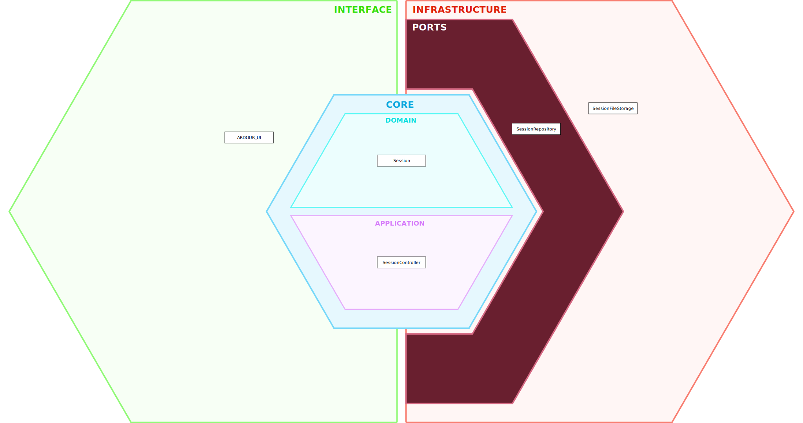

[← Back to Use Cases](../use-cases.md#01-session-management) 

[← Back to Requirements](../requirements/01-03.md)

# 01-03 Save Session

## Components

| Component | Layer | Responsibility |
| - | - | - |
| **ARDOUR_UI** | Interface | Provides the **Save Session** user interface, captures the user's save request, and presents the operation result. |
| **SessionController** | Core / Application | Coordinates the **Save Session** use case by requesting the current session to be saved through the repository and handling the outcome. |
| **Session** | Core / Domain | Provides the current session state to be persisted and updates its modified state after a successful save. |
| **SessionRepository** | Infrastructure / Ports | Defines the interface for persisting a session without exposing storage details. |
| **SessionFileStorage** | Infrastructure | Persists the session data to the project file and reports success or failure to the repository implementation. |

## Workflow

TBD.