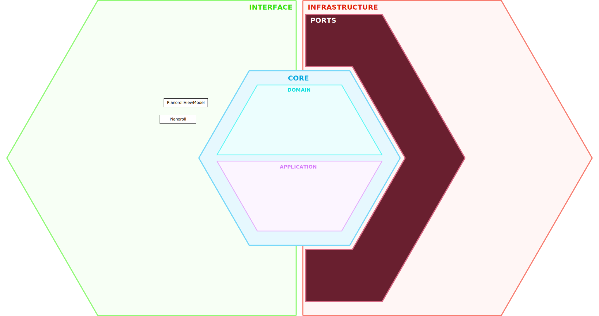

[← Back to Use Cases](../use-cases.md#05-piano-roll) 

[← Back to Requirements](../requirements/05-10.md)

# 05-10 Set Editing Scope

## Components

| Component | Layer | Responsibility |
| - | - | - |
| **Pianoroll** | Interface / Presenter | Presents the editing scope selection UI, forwards user selections to the ViewModel, and updates the user interface in response to ViewModel state changes. |
| **PianorollViewModel** | Interface / Presenter | Stores and exposes the current editing scope, restores the previously selected editing scope or applies the default value, and updates the editing scope in response to user selections. |

## Workflow

TBD.